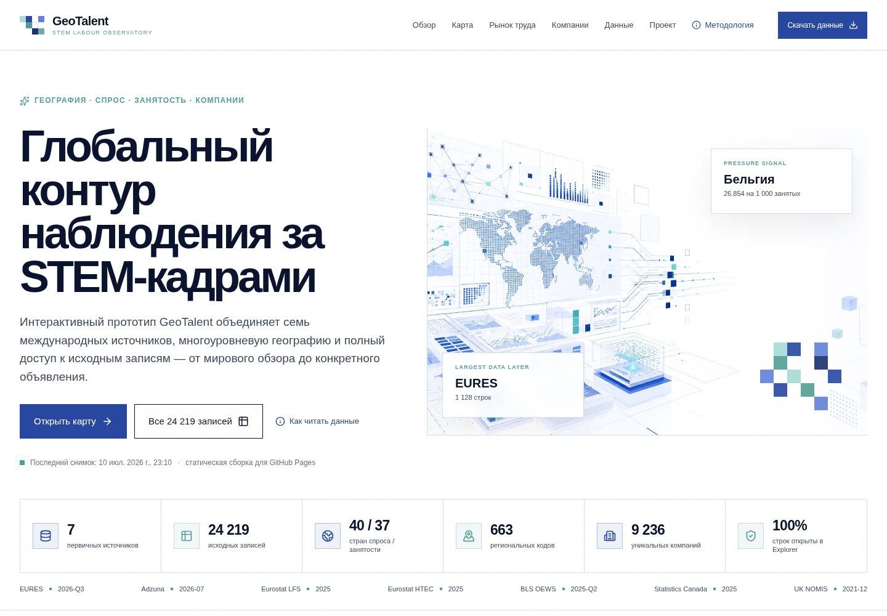
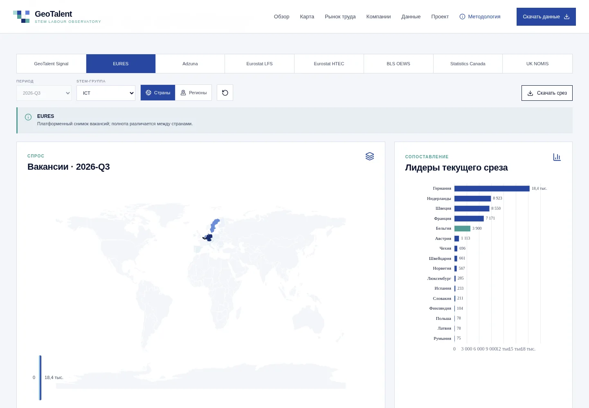
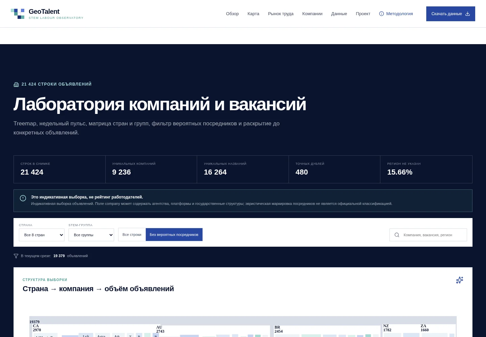
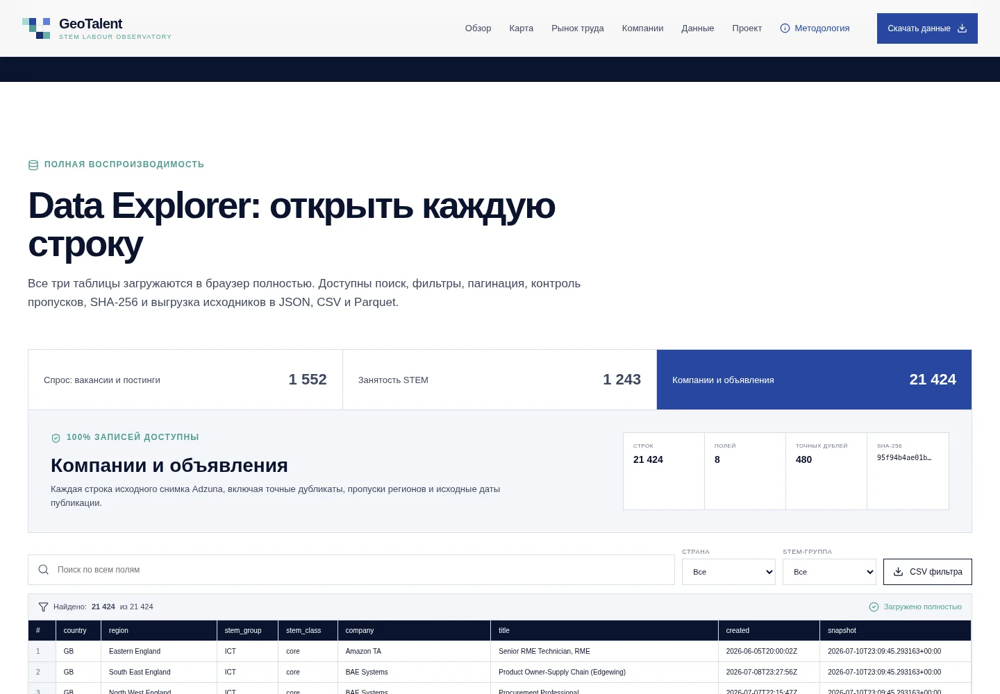

# GeoTalent — глобальная геоаналитика STEM-кадров

Интерактивная статическая витрина для GitHub Pages. Проект объединяет географию спроса и занятости, профили стран и регионов, анализ компаний, полный Data Explorer и публичную часть проектного досье.



## Что находится в репозитории

Витрина построена на React, Vite, Apache ECharts и Lucide. Production-сборка уже находится в `docs/`, поэтому сайт можно опубликовать из ветки `main` и каталога `/docs` без локальной сборки. Одновременно в `.github/workflows/pages.yml` включён автоматический сценарий сборки и публикации через GitHub Actions.

Исходный охват составляет 24 219 записей: 1 552 строки вакансий и постингов, 1 243 строки занятости и 21 424 строки снимка компаний и объявлений. В Data Explorer доступны все строки, все поля, поиск, фильтрация, пагинация, статистика пропусков и экспорт отфильтрованного CSV. Полные исходники также лежат в `public/downloads/` и публикуются в `docs/downloads/` в CSV и Parquet; браузерные версии находятся в `public/data/` и `docs/data/` в JSON.

## Аналитические поверхности

Главный экран показывает масштаб набора данных и архитектуру доказательств. Географический модуль координирует карту, рейтинг стран, структуру STEM-групп, временной ряд и субнациональный профиль. Рынок труда разделяет платформенный спрос и статистическую занятость. Лаборатория компаний включает treemap, недельный пульс, матрицу «страна × STEM-группа», рейтинг компаний и раскрытие до отдельных объявлений. Data Explorer открывает 100% записей. Проектный раздел показывает архитектуру продукта, TAM/SAM/SOM, предложения, риски, команду, историю и дорожную карту.

## Методологический контракт

Национальные агрегаты не суммируются с субнациональными строками. Единицы `count`, `thousands` и `persons` не смешиваются. ENG/ICT/SCI, Eurostat HRST, канадская NOC и британская SOC2010 остаются отдельными классификационными контурами. Вакансии являются снимком, а не временным рядом; тренды строятся только для Eurostat LFS и HTEC за 2023–2025 годы. UK NOMIS везде маркируется периодом `2021-12`. Выборка компаний трактуется как индикативная и может включать агентства, платформы и государственные структуры.

## Публикация на GitHub Pages

### Вариант A — GitHub Actions

1. Создайте пустой репозиторий и загрузите в него содержимое ZIP-архива, сохранив скрытую папку `.github`.
2. Откройте `Settings → Pages`.
3. В поле `Source` выберите `GitHub Actions`.
4. Сделайте commit в ветку `main` или запустите workflow вручную на вкладке `Actions`.

Workflow устанавливает Node.js 22, выполняет `npm ci`, собирает `docs`, проверяет полноту данных и публикует артефакт.

### Вариант B — готовый каталог `/docs`

1. Загрузите файлы в ветку `main`.
2. Откройте `Settings → Pages`.
3. Выберите `Deploy from a branch`.
4. Укажите `main` и `/docs`, затем нажмите `Save`.

Подробная инструкция находится в [PUBLISH_GITHUB_PAGES.md](PUBLISH_GITHUB_PAGES.md).

## Локальный запуск

```bash
npm ci
npm run dev
```

Production-сборка с проверкой комплектности:

```bash
npm run check
```

Опциональный браузерный QA:

```bash
npx playwright install chromium
npm run qa
```

## Пересборка данных

В ZIP уже включены самодостаточные исходники в `public/downloads/`. Скрипт сначала использует эти файлы, а затем — пути, переданные через переменные окружения.

```bash
python -m pip install pandas pyarrow shapely
python scripts/build_data.py
npm run check
```

Можно переопределить входы через `GEOTALENT_VACANCIES`, `GEOTALENT_EMPLOYMENT`, `GEOTALENT_COMPANIES`, `GEOTALENT_WORLD`, `GEOTALENT_GUIDE` и `GEOTALENT_REFERENCE`.

## Figma

Редактируемые экраны находятся на странице **GeoTalent — Dashboard** в исходном Figma-файле:

- Desktop Overview: `100:3`;
- Desktop Data Lab: `100:429`;
- Mobile Overview: `100:707`;
- Tokens & Components: `100:918`.

Открыть макет: https://www.figma.com/design/HBsYBQ1h6HqukLfPJKnTlR/?node-id=100-2

## Публичность и персональные данные

STEM-таблицы и геометрия опубликованы полностью. Исходная проектная анкета в XLSX не входит в публичный GitHub-пакет, поскольку содержит персональные идентификаторы участников. Вместо неё включены `project_public.json` и `PROJECT_DOSSIER_PUBLIC.md`, содержащие весь использованный в дашборде публично допустимый проектный материал. Перед внешней публикацией владелец репозитория должен дополнительно проверить права на распространение первичных данных и логотипов.

## Галерея

| Геоаналитика | Компании | Data Explorer |
|---|---|---|
|  |  |  |

Полноразмерный длинный рендер: [preview/full-desktop.webp](preview/full-desktop.webp). Отчёт о проверке: [QA_REPORT.md](QA_REPORT.md). Figma handoff: [FIGMA_HANDOFF.md](FIGMA_HANDOFF.md).
