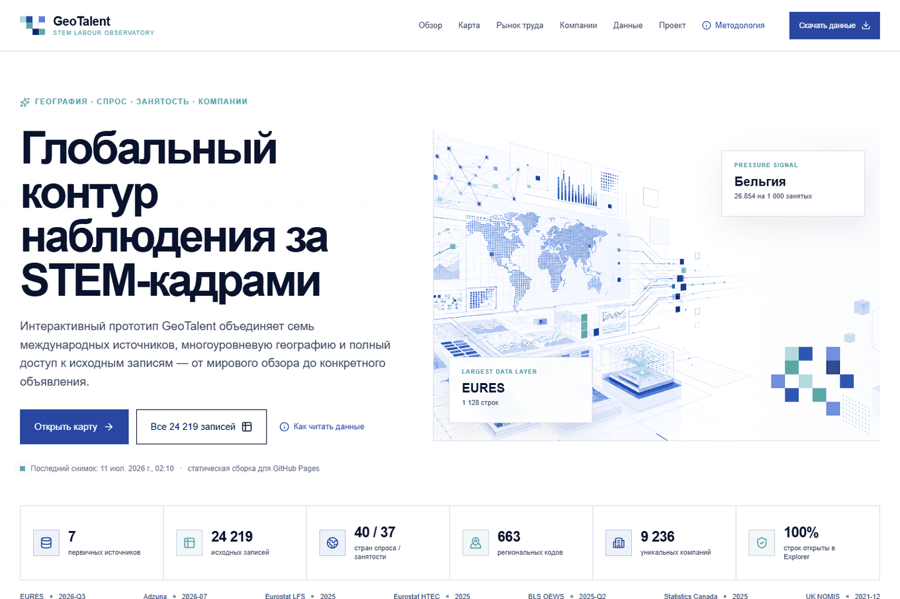
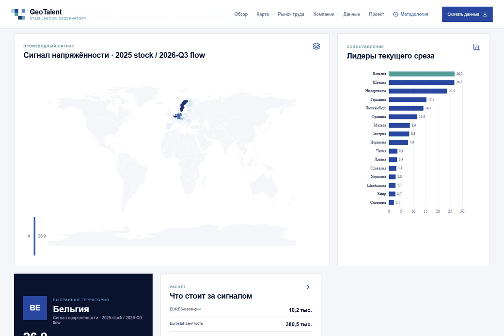
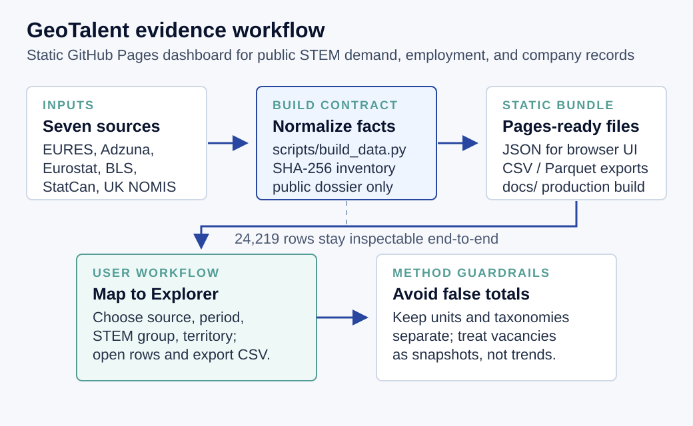
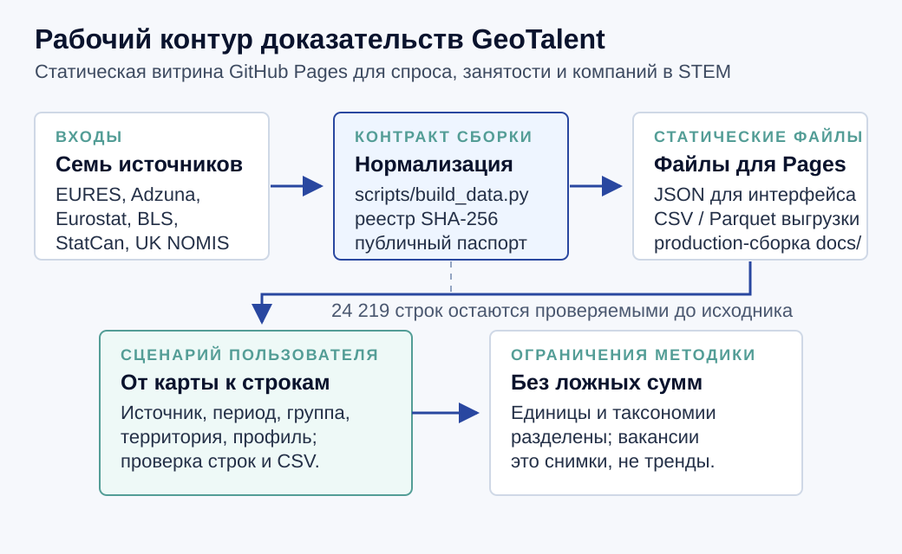

<a id="english"></a>

# GeoTalent — STEM Labour Observatory

[English](#english) · [Русский](#russian) · [Live site](https://arseniy24rus.github.io/GeoTalent-alpha-dashboard/)



GeoTalent is a static React dashboard for exploring public STEM labour-market signals by source, territory and evidence level. It is aimed at analysts, product owners, education teams and public-sector stakeholders who need to understand where STEM demand appears, where STEM employment is measured, and how much confidence the underlying data can support. The current application interface is Russian-only; this bilingual README explains the repository for both Russian- and English-speaking reviewers.

The project is not a forecasting engine or an official labour-shortage index. It is a public demonstrator that keeps the source records visible. The app starts with a high-level overview, then lets a user move through a practical analysis path: map → territory profile → indicators and data explorer. On the map surface, a user chooses a source such as EURES, Adzuna, Eurostat LFS, Eurostat HTEC, BLS OEWS, Statistics Canada or UK NOMIS, filters by period and STEM group where available, selects a country, and reads synchronized rankings, composition charts, time-series panels or regional profiles. The Data Explorer then exposes the raw rows behind the story with search, filters, pagination, missingness statistics and CSV export.



_Demo: the Russian UI moves from the overview to map filtering, selected-territory context and row-level Data Explorer search._

## What is included

The repository contains both source and a prebuilt GitHub Pages bundle. The React/Vite app lives under [src/](src/), with the main shell in [src/App.jsx](src/App.jsx), the coordinated map in [src/components/MapExplorer.jsx](src/components/MapExplorer.jsx), labour-market charts in [src/components/LabourLab.jsx](src/components/LabourLab.jsx), company analysis in [src/components/CompanyLab.jsx](src/components/CompanyLab.jsx), and row-level inspection in [src/components/DataExplorer.jsx](src/components/DataExplorer.jsx). The static production build is committed under [docs/](docs/) and uses relative paths configured in [vite.config.js](vite.config.js), so it can be served from GitHub Pages without a backend.

The public dataset contains 24,219 tabular records: 1,552 demand rows, 1,243 employment rows and 21,424 company/posting rows. Browser JSON files are in [public/data/](public/data/); downloadable CSV and Parquet files are in [public/downloads/](public/downloads/) and mirrored into [docs/downloads/](docs/downloads/). Completeness, file sizes and checksums are documented in [public/downloads/DATA_INVENTORY.md](public/downloads/DATA_INVENTORY.md) and [public/downloads/DATA_INVENTORY.json](public/downloads/DATA_INVENTORY.json).



_Architecture: source files are normalized into a static Pages bundle, then explored through map, profile and data surfaces with methodology guardrails._

## Methodology and limitations

The dashboard deliberately separates sources, units, periods and taxonomies. National rows are not added to subnational rows. `count`, `thousands` and `persons` are not mixed as if they were one scale. ENG/ICT/SCI, Eurostat HRST, Canadian NOC and UK SOC2010 classifications remain separate analytical circuits. Vacancy and company data are snapshots, not time series; trends are shown only for the Eurostat LFS and HTEC sources that provide 2023-2025 history. UK NOMIS is labeled as a December 2021 layer and should not be read as current data. The derived GeoTalent Signal compares EURES STEM vacancies with Eurostat STEM employment per 1,000 employed people; it is a navigation signal, not an official shortage rate.

The strongest source note is in [public/downloads/DASHBOARD_GUIDE.md](public/downloads/DASHBOARD_GUIDE.md). The public data-scope note in [SECURITY_AND_DATA_SCOPE.md](SECURITY_AND_DATA_SCOPE.md) explains that the original project questionnaire is not included because it contained personal identifiers; the dashboard uses [public/data/project_public.json](public/data/project_public.json) and [public/downloads/PROJECT_DOSSIER_PUBLIC.md](public/downloads/PROJECT_DOSSIER_PUBLIC.md) instead.

## Run and verify

```bash
npm ci
npm run dev
```

Production build and repository checks:

```bash
npm run check
```

The `check` script builds [docs/](docs/) and runs [scripts/verify.mjs](scripts/verify.mjs), which validates row counts, Parquet SHA-256 values, required Pages files and the absence of public XLSX workbooks. Optional rendered QA is available through:

```bash
npm run qa
```

<details>
<summary>Rebuild the input tables</summary>

If the input tables need to be rebuilt, install the Python data dependencies and run:

```bash
python -m pip install pandas pyarrow shapely
python scripts/build_data.py
npm run check
```

The build script prefers the self-contained source files in [public/downloads/](public/downloads/) and can be redirected with `GEOTALENT_VACANCIES`, `GEOTALENT_EMPLOYMENT`, `GEOTALENT_COMPANIES`, `GEOTALENT_WORLD`, `GEOTALENT_GUIDE` and `GEOTALENT_REFERENCE`.

</details>

## Deployment, licensing and attribution

The live site is published at [arseniy24rus.github.io/GeoTalent-alpha-dashboard](https://arseniy24rus.github.io/GeoTalent-alpha-dashboard/). GitHub Pages can use either the workflow in [.github/workflows/pages.yml](.github/workflows/pages.yml) or the committed [docs/](docs/) folder, as described in [PUBLISH_GITHUB_PAGES.md](PUBLISH_GITHUB_PAGES.md). The project uses React, Vite, Apache ECharts and Lucide React; dependency versions are listed in [package.json](package.json). No root `LICENSE` file is present in this repository, so do not assume the code, compiled assets or bundled data are released under an open-source license. Original data, logos and third-party packages remain governed by their own providers' terms; verify redistribution rights before external publication.

<details>
<summary>Original gallery and handoff references</summary>

Older preview renders remain available in [preview/](preview/): [overview](preview/overview.webp), [map](preview/map.webp), [companies](preview/companies.webp), [explorer](preview/explorer.webp), [downloads and project](preview/downloads-and-project.webp), [mobile](preview/mobile.webp) and [full desktop](preview/full-desktop.webp). The project also includes [QA_REPORT.md](QA_REPORT.md) and [FIGMA_HANDOFF.md](FIGMA_HANDOFF.md).

</details>

<a id="russian"></a>

# GeoTalent — геоаналитика STEM-кадров

[English](#english) · [Русский](#russian) · [Живой сайт](https://arseniy24rus.github.io/GeoTalent-alpha-dashboard/)


GeoTalent — статическая React-витрина для исследования публичных сигналов рынка STEM-кадров по источникам, территориям и уровню доказательности. Она нужна аналитикам, продуктовым командам, образовательным организациям и публичным заказчикам, которым важно видеть не только выводы, но и строки, из которых они собраны. Интерфейс приложения сейчас только на русском языке; двуязычный README объясняет репозиторий для русскоязычных и англоязычных рецензентов.

Проект не является системой прогнозирования и не публикует официальный индекс дефицита кадров. Это демонстрационный публичный контур, где исходные записи остаются проверяемыми. Пользовательский сценарий устроен как переход от карты к территории и данным: обзор показывает масштаб набора, карта позволяет выбрать источник, период, STEM-группу и страну, профиль территории синхронно обновляет рейтинг, структуру, тренд или региональный срез, а Data Explorer открывает исходные строки с поиском, фильтрами, пагинацией, статистикой пропусков и экспортом CSV.


_Демо: русский интерфейс проходит от обзора к фильтрам карты, выбранной территории и поиску по строкам в Data Explorer._

## Состав репозитория

В репозитории лежат и исходники, и готовая сборка для GitHub Pages. Приложение на React/Vite находится в [src/](src/): основной каркас описан в [src/App.jsx](src/App.jsx), координированная карта — в [src/components/MapExplorer.jsx](src/components/MapExplorer.jsx), рынок труда — в [src/components/LabourLab.jsx](src/components/LabourLab.jsx), компании — в [src/components/CompanyLab.jsx](src/components/CompanyLab.jsx), построчная проверка — в [src/components/DataExplorer.jsx](src/components/DataExplorer.jsx). Production-сборка уже находится в [docs/](docs/) и использует относительный `base` из [vite.config.js](vite.config.js), поэтому сайт работает без серверной части.

Публичный набор включает 24 219 табличных записей: 1 552 строки спроса, 1 243 строки занятости и 21 424 строки компаний/объявлений. JSON для браузера лежит в [public/data/](public/data/), CSV и Parquet — в [public/downloads/](public/downloads/) и зеркале [docs/downloads/](docs/downloads/). Полнота, размеры и контрольные суммы зафиксированы в [public/downloads/DATA_INVENTORY.md](public/downloads/DATA_INVENTORY.md) и [public/downloads/DATA_INVENTORY.json](public/downloads/DATA_INVENTORY.json).



_Архитектура: исходные файлы нормализуются в статическую сборку Pages, а пользователь проверяет их через карту, профиль территории и Data Explorer с методическими ограничениями._

## Методика и ограничения

Витрина намеренно разделяет источники, единицы, периоды и классификации. Национальные строки не суммируются с региональными. `count`, `thousands` и `persons` не складываются как одна шкала. ENG/ICT/SCI, Eurostat HRST, канадская NOC и британская SOC2010 остаются отдельными контурами. Вакансии и компании — разовые снимки, а не временные ряды; тренды показаны только там, где Eurostat LFS и HTEC дают историю за 2023-2025 годы. UK NOMIS везде помечается как слой декабря 2021 года. Производный GeoTalent Signal сравнивает EURES STEM-вакансии с Eurostat STEM-занятостью на 1 000 занятых; это навигационный сигнал, а не официальная норма дефицита.

Главная методическая справка находится в [public/downloads/DASHBOARD_GUIDE.md](public/downloads/DASHBOARD_GUIDE.md). Документ [SECURITY_AND_DATA_SCOPE.md](SECURITY_AND_DATA_SCOPE.md) объясняет, почему исходная проектная анкета не опубликована: в ней были персональные идентификаторы. Вместо неё используются [public/data/project_public.json](public/data/project_public.json) и [public/downloads/PROJECT_DOSSIER_PUBLIC.md](public/downloads/PROJECT_DOSSIER_PUBLIC.md).

## Запуск и проверки

```bash
npm ci
npm run dev
```

Production-сборка и проверка репозитория:

```bash
npm run check
```

Скрипт `check` собирает [docs/](docs/) и запускает [scripts/verify.mjs](scripts/verify.mjs): он проверяет количество строк, SHA-256 исходных Parquet, обязательные файлы Pages и отсутствие публичных XLSX-источников. Дополнительный браузерный QA:

```bash
npm run qa
```

<details>
<summary>Пересборка входных таблиц</summary>

Для пересборки входных таблиц:

```bash
python -m pip install pandas pyarrow shapely
python scripts/build_data.py
npm run check
```

Скрипт сборки сначала использует самодостаточные файлы из [public/downloads/](public/downloads/), а при необходимости принимает `GEOTALENT_VACANCIES`, `GEOTALENT_EMPLOYMENT`, `GEOTALENT_COMPANIES`, `GEOTALENT_WORLD`, `GEOTALENT_GUIDE` и `GEOTALENT_REFERENCE`.

</details>

## Публикация, лицензии и атрибуция

Живой сайт опубликован на [arseniy24rus.github.io/GeoTalent-alpha-dashboard](https://arseniy24rus.github.io/GeoTalent-alpha-dashboard/). Для Pages можно использовать workflow [.github/workflows/pages.yml](.github/workflows/pages.yml) или готовый каталог [docs/](docs/), подробнее — в [PUBLISH_GITHUB_PAGES.md](PUBLISH_GITHUB_PAGES.md). Проект использует React, Vite, Apache ECharts и Lucide React; версии указаны в [package.json](package.json). В корне репозитория нет файла `LICENSE`, поэтому нельзя считать код, собранные материалы или данные открыто лицензированными. Первичные данные, логотипы и сторонние пакеты остаются под условиями своих правообладателей; перед внешней публикацией нужно проверить права на распространение.

<details>
<summary>Старые превью и handoff-материалы</summary>

Ранние рендеры остаются в [preview/](preview/): [overview](preview/overview.webp), [map](preview/map.webp), [companies](preview/companies.webp), [explorer](preview/explorer.webp), [downloads and project](preview/downloads-and-project.webp), [mobile](preview/mobile.webp) и [full desktop](preview/full-desktop.webp). Также сохранены [QA_REPORT.md](QA_REPORT.md) и [FIGMA_HANDOFF.md](FIGMA_HANDOFF.md).

</details>
